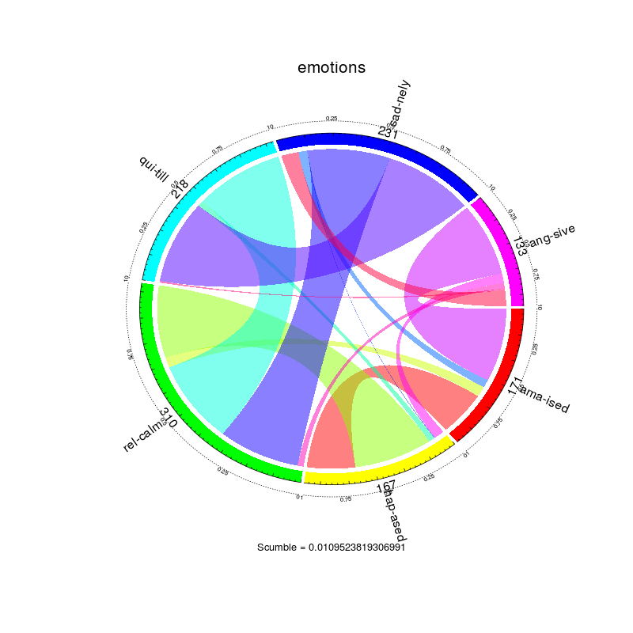

## Relevancia del problema.

Diariamente se recopilan enormes cantidades de datos e información útil desde
redes sociales, ventas, organizaciones [... % Rellenar]
Toda esta información sólo es útil si se extraen patrones y conocimiento de
estas grandes bases de datos. Ese conocimiento puede usarse para predecir y
para tomar decisiones basadas en la información.

 * Beneficios económicos:
     Optimización de decisiones logísticas y empresariales (tratamientos en
     hospitales, ventas de la empresa). Automatización de procesos humanos
     (detección y clasificación de especies o de dígitos).

 * Beneficios para los usuarios:
     Aprovechan el conocimiento de las grandes bases de datos en servicios
     (recomendaciones personalizadas, inteligencia)

 * Mejora de la vida de las personas:
     Automatización de procesos. Detección de enfermedades.

Todos los datos recolectados por una organización pueden ser útiles para
mejorar las decisiones futuras de la organización. Para usar los enormes
volúmenes de datos que se recolectan, es necesario encontrar patrones en
ellos. Un ejemplo de uso de clasificación de datos lo constituyen los anuncios
publicitarios de *Google Ads*: se recolecta información sobre las búsquedas en
la web de un usuario y se le muestra un determinado tipo de anuncios en función
de la clasificación de sus preferencias a través de la información recolectada.
Por tanto detrás de la clasificación de datos hay un beneficio económico
potencialmente explotable.

La clasificación puede usarse para predecir enfermedades (se estudia si una
persona tiene características genéticas determinadas y se puede predecir si padecerá o
podría padecer la enfermedad en función de ellas).

Puede suponer un importante ahorro en recursos para una empresa, esto es, se estudia qué
datos de los almacenados por una empresa resultan más relevantes para su utilidad, y se reducen
los recursos destinados a los menos relevantes.
    
Resulta relevante para las empresas la creación de perfiles de clientes efectuando 
clasificación a partir de unos datos aportados por el usuario. Por ejemplo, existen
empresas de préstamos rápidos vía contacto telefónico o internet que predicen si un 
determinado usuario devolverá el préstamo a partir de las respuestas aportadas por el mismo
a una serie de preguntas.

Referencia: Alex A. Freitas - A Survey of Evolutionary Algorithms for Data
Mining and Knowledge Discovery - Introduction

## Descripción del problema

Extracción de conocimiento de grandes bases de datos.

Un problema de clasificación es el problema de asignar una clase a cada una de
las instancias de un conjunto en función de sus atributos. (Por ejemplo,
clasificar flores por especie según las medidas de sus pétalos)

Normalmente poseeremos un conjunto de instancias de entrenamiento, ya clasificadas, que
usaremos como base para que el ordenador aprenda a clasificar las siguientes.
(En el ejemplo, tenemos un conjunto de flores de las que conocemos la especie ya
clasificadas).

El problema consistirá en clasificar las nuevas instancias que nos vayan
llegando, de las que sólo conoceremos los atributos.

## Justificación del uso de la IA

En el mundo de la minería de datos, y concretamente en el problema de 
clasificación, se pretende predecir nuevos datos a partir de la información
con la que contamos. Esto requiere de técnicas que permitan extraer patrones,
relaciones entre los datos a predecir y los conocidos, incluso aquellas que
los humanos no sepamos apreciar, a causa de nuestra perspectiva de cada
problema concreto.

Además, la cantidad ingente de datos (tanto instancias
como atributos) que se suelen analizar impiden que una persona aborde el
problema. Por tanto, no solo se utiliza la gran capacidad de computación
disponible, sino que se han de implementar heurísticas que nos permitan
realizar la clasificación de los nuevos datos, de forma racional, es decir,
atendiendo a ciertos criterios acerca de cómo se relacionan los datos.

## Aplicación 3. Clasificación multietiqueta de música en emociones

La detección de emociones en música se puede modelar como un problema de 
clasificación multietiqueta. Un problema de este tipo implica que una instancia
puede pertenecer a más de una clase, en cuyo caso las denominamos etiquetas.
Por tanto, el problema requiere predecir, para cada nueva instancia, el conjunto de 
etiquetas a las que pertenece.

Observamos que esta variante del problema es mucho más difícil que las anteriores,
puesto que el número de respuestas posibles aumenta exponencialmente con el número
de etiquetas (2^l para l etiquetas). En general, este problema se puede tratar de 
dos maneras: transformación de los datos en uno o varios problemas de un tipo más 
simple, o adaptación de los algoritmos conocidos a este tipo de problemas.

Por un lado, las transformaciones de los datos reducen el problema a tantos
problemas binarios como etiquetas (transformación Binary Relevance), o bien a 
un problema multiclase considerando el conjunto de etiquetas de cada instancia 
como una posible clase (transformación Label Powerset). Estas transformaciones 
utilizan algún algoritmo de clasificación por debajo para realizar el trabajo 
sobre los problemas más sencillos, y después agrupan o adaptan las soluciones 
obtenidas a una para el problema multietiqueta.

Por otro lado, algunos algoritmos que se utilizan se basan en mejorar la técnica
Label Powerset reduciendo el número de etiquetas y entrenando varios clasificadores
(algoritmos como HOMER, RAkEL), y otros tratan de adaptarse a la nueva situación
realizando cálculos con las etiquetas (por ejemplo, ML-kNN, que realiza una cuenta
de ocurrencias de etiquetas para las instancias más cercanas).

Algunos de los avances en el tratamiento de este problema, sin embargo, no están
en la clasificación en sí, sino en el preprocesamiento del dataset (un tratamiento
que se realiza a los datos para mejorar la solución del clasificador). Existen
nuevas técnicas que, basándose en medidas de desequilibrio de etiquetas y otras
relaciones entre ellas, permiten actuar sobre el dataset (por ejemplo, desactivando
etiquetas mayoritarias de ciertas instancias) de forma que al aplicar
un clasificador sobre él los resultados sean mejores.

Para la aplicación de clasificación de música, se utilizaron casi 600 fragmentos
de canciones de 30 segundos y se analizaron el ritmo y el timbre, dando lugar a 
más de 70 atributos de entrada para cada canción. En la figura siguiente se
muestra visualmente cómo se relacionan sus 6 etiquetas, algo que un algoritmo de
preprocesamiento o clasificación deberá tener en cuenta y actuar en consecuencia:

Referencias:
  - Trohidis, K.; Tsoumakas, G.; Kalliris, G.; Vlahavas, I. - Multi-Label 
  Classification of Music into Emotions
  - Min-Ling Zhang; Zhi-Hua Zhou - ML-kNN: A Lazy Learning Approach to Multi-Label 
  Learning
  - Tsoumakas, G.; Katakis, I.; Vlahavas, I. - Effective and Efficient Multilabel 
  Classification in Domains with Large Number of Labels
  - Tsoumakas, G.; Katakis, I.; Vlahavas, I. - Random k-Labelsets for Multi-Label 
  Classification